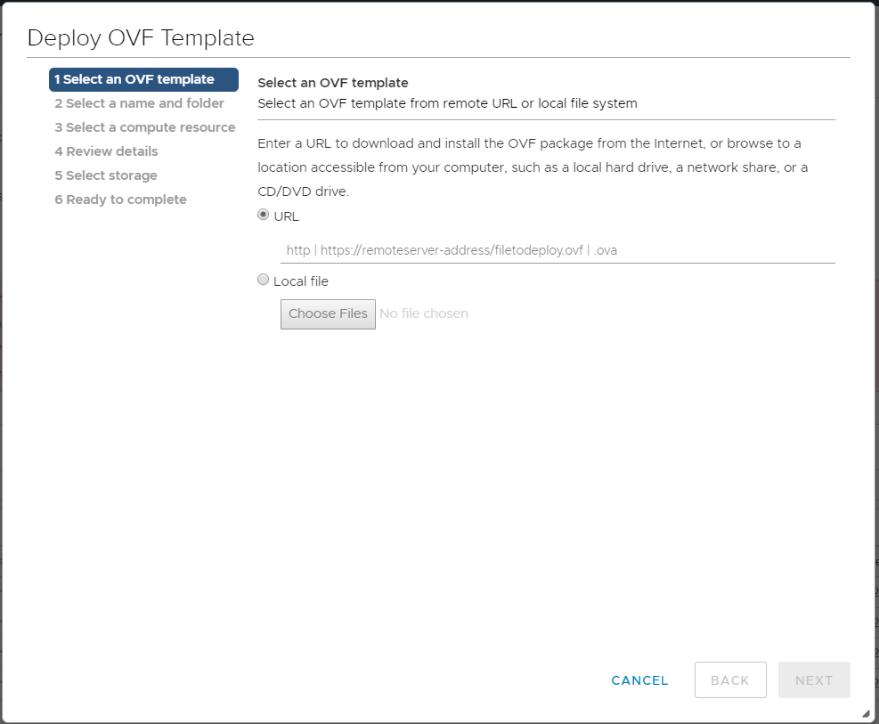
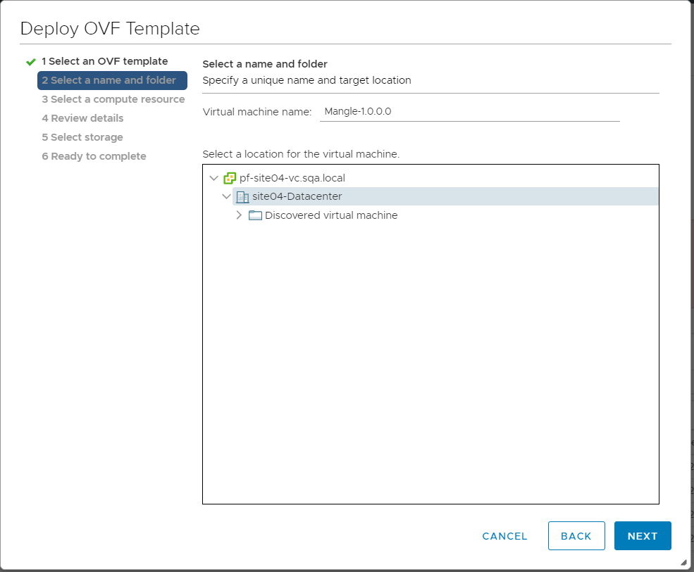
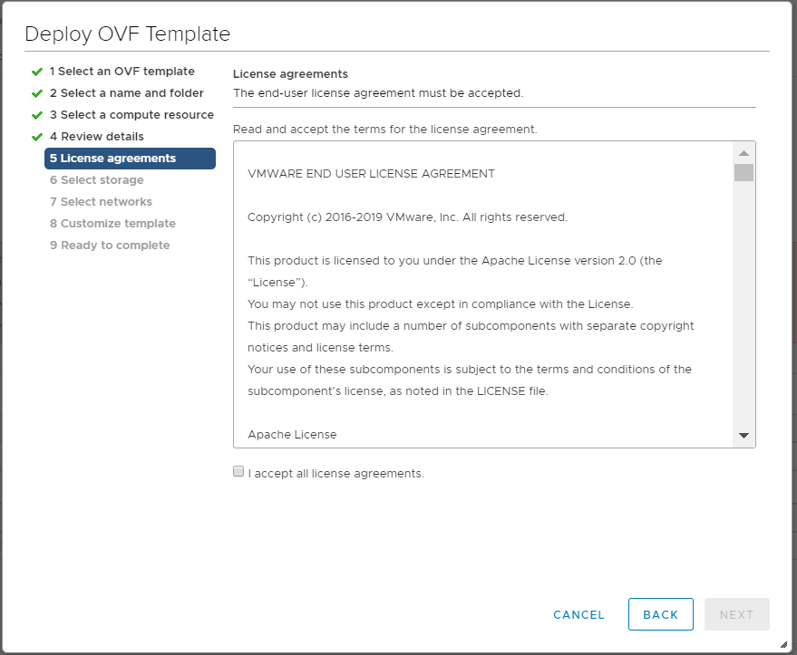
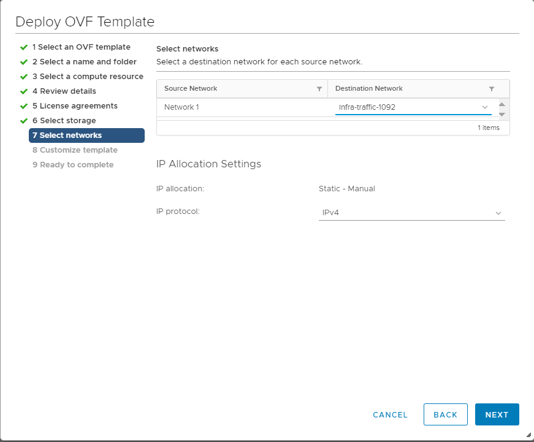

# Supported Deployment Models

## Single Node Deployments

### Deploying the Mangle Virtual Appliance

For a quick POC we recommend that you deploy a single node instance of Mangle using the OVA file that we have made available [here](https://dl.bintray.com/vmware/photon/3.0/GA/ova/photon-hw11-3.0-26156e2.ova).

Using the OVA is a fast and easy way to create a Mangle VM on VMware vSphere.

After you have downloaded the OVA, log in to your vSphere environment and perform the following steps:

1. Start the Import Process

   From the Actions pull-down menu for a datacenter, choose **Deploy OVF Template**.

   

   Provide the location of the downloaded ova file.

   Choose **Next**.

2. Specify the name and location of virtual machine                      Enter a name for the virtual machine and select a location for the virtual machine.

   

   Choose **Next**.

3. Specify the compute resource

   Select a cluster, host or resource pool where the virtual machine needs to be deployed.

   

   Choose **Next**.

4. Review details

    

   Choose **Next**.

5. Accept License Agreement

   Read through the Mangle License Agreement, and then choose **I accept all license agreements**.

   

   Choose **Next**.

6. Select Storage

   Mangle is provisioned with a maximum disk size. By default, Mangle uses only the portion of disk space that it needs, usually much less that the entire disk size \( **Thin** client\). If you want to pre-allocate the entire disk size \(reserving it entirely for Mangle instead\), select **Thick** instead.

   

   Choose **Next**.

7. Select Network

   Provide a static or dhcp IP for Mangle after choosing an appropriate destination network.  

    

   Choose **Next**.

8. Verify Deployment Settings and click **Finish** to start creating the virtual machine. Depending on bandwidth, this operation might take a while. When finished, vSphere powers up the Mangle VM based on your selections.

After the VM is booted, open the command window. vSphere prompts you to log in.

**Note**: Because of limitations within OVA support on vSphere, it was necessary to specify a default password for the OVA option. However, all Mangle instances that are created by importing the OVA require an immediate password change upon login. The default account credentials are:

* Username: `root`
* Password: `changeme`

  After you provide these credentials, vSphere prompts you to create a new password and type it a second time to verify it.

  **Note:** For security, Mangle forbids common dictionary words for the root password.

  Once logged in, you will see the shell prompt.

* The Mangle application should be available at the following URL: _https://&lt;IP or Hostname provided&gt;/mangle-services_
* You will be prompted to change the admin password to continue.
  * Default Mangle Username: `admin@mangle.local`
  * Password: `admin`

Export the VM as a Template \(Optional\)

Consider converting this imported VM into a template \(from the Actions menu, choose **Export** \) so that you have a master Mangle instance that can be combined with vSphere Guest Customization to enable rapid provisioning of Mangle instances.

### Deploying the Mangle Containers

#### Prerequisites

Before creating the Mangle container a Cassandra DB container should be made available on a Docker host. You can setup a docker host by following the instructions [here](https://docs.docker.com/install/).

To deploy a Cassandra DB container without enabling authentication or ssl run the docker command below on the docker host.

```text
docker run --name mangle-cassandradb -v /cassandra/storage/:/var/lib/cassandra -p 9042:9042 -d -e CASSANDRA_CLUSTER_NAME=<Cluster Name> -e CASSANDRA_DC="DC1" -e CASSANDRA_RACK="rack1" -e CASSANDRA_ENDPOINT_SNITCH="GossipingPropertyFileSnitch"  mangle-docker-containers.bintray.io/mangle-cassandradb:$MANGLE_CASSANDRA_VERSION
```

To enable authentication or clustering on Cassandra refer to the [Cassandra Advanced Configuration](advanced-cassandra-configuration.md).

To deploy the Mangle container run the docker command below on the docker host.

```text
docker run --name mangle -d -e DB_OPTIONS="-DcassandraContactPoints=$(docker inspect --format '{{ .NetworkSettings.IPAddress }}' mangle-cassandradb) -DcassandraUsername= -DcassandraSslEnabled=false" -e CLUSTER_OPTIONS="-DhazelcastValidationToken=mangle" -p 8080:8080 -p 8443:8443 mangle-docker-containers.bintray.io/mangle:$MANGLE_VERSION
```

## Multi Node Deployment

A multi-node setup for Mangle ensures availability in case of unexpected failures. We recommend that you use a 3 node Mangle setup. 

#### Prerequisites

You need at least 3 docker hosts for setting up a multi node Mangle instance. You can setup a docker host by following the instructions [here](https://docs.docker.com/install/).

A multi node setup of Mangle is implemented using Hazelcast. Mangle multi node setup uses TCP connection to communicate with each other. The configuration of the setup is handled by providing the right arguments to the docker container run command, which identifies the cluster.

The Mangle docker container takes an environmental variable "**CLUSTER\_OPTIONS**", which can take a list of java arguments identifying the properties of the cluster. Following are the different arguments that should be part of "CLUSTER\_OPTIONS":  
  
**clusterName** - A unique string that identifies the cluster to which the current mangle app will be joining. If not provided, the Mangle app will by default use string "mangle" as the clusterName, and if this doesn't match the one already configured with the cluster, the node is trying to join to, container start fails.  
  
**clusterValidationToken** - A unique string which will act similar to a password for a member to get validated against the existing cluster. If the validation token doesn't match with the one that is being used by the cluster, the container will fail to start.

**publicAddress** - IP of the docker host on which the mangle application will be deployed. This is the IP that mangle will use to establish a connection with the other members that are already part of the cluster, and hence it is necessary to provide the host IP and make sure the docker host is discoverable from other nodes  
  
**clusterMembers** - This is an optional property that takes a comma-separated list of IP addresses that are part of the cluster. If not provided, Mangle will query DB and find the members of the cluster that is using the DB and will try connecting to that automatically. It is enough for mangle to connect to at least one member to become part of the cluster. 


**NOTE:** 

All the nodes \(docker hosts\) participating in the cluster should be synchronized with a single time server.

If a different mangle app uses the same clusterValidationToken, clusterName and DB of existing cluster, the node will automatically joins that existing cluster.

All the mangle app participating in the cluster should use the same cassandra DB. 

The properties clusterValidationToken and publicAddress are mandatory for any mangle container spin up, if not provided container will fail to start. 


Deploy a Cassandra DB container on one of the three docker hosts or on a separate host.

```text
docker run --name mangle-cassandradb -v /cassandra/storage/:/var/lib/cassandra -p 9042:9042 -d -e CASSANDRA_CLUSTER_NAME=<Cluster Name> -e CASSANDRA_DC="DC1" -e CAS
```

Deploy the Mangle cluster by bringing up the mangle container in each docker host.

**For the first node in the cluster:**

```text
docker run --name mangle -d -v /var/opt/mangle-tomcat/logs:/var/opt/mangle-tomcat/logs -e DB_OPTIONS="-DcassandraContactPoints=<Cassandra-IP>" -e CLUSTER_OPTIONS="-DclusterName=<CLUSTER-NAME> -DclusterValidationToken=<CLUSTER-VALIDATION-TOKEN> -DpublicAddress=<DOCKER-HOST-IP-1>" -p 8080:8080 -p 443:8443 -p 5701:5701 mangle-docker-containers.bintray.io/mangle:$MANGLE_VERSION
```

**For the subsequent nodes in the cluster:**

```text
docker run --name mangle -d -v /var/opt/mangle-tomcat/logs:/var/opt/mangle-tomcat/logs -e DB_OPTIONS="-DcassandraContactPoints=<Cassandra-IP>" -e CLUSTER_OPTIONS="-DclusterName=<CLUSTER-NAME> -DclusterValidationToken=<CLUSTER-VALIDATION-TOKEN> -DpublicAddress=<DOCKER-HOST-IP-2> -DclusterMembers=<DOCKER-HOST-IP-1>" -p 8080:8080 -p 443:8443 -p 5701:5701 mangle-docker-containers.bintray.io/mangle:$MANGLE_VERSION
```

```text
docker run --name mangle -d -v /var/opt/mangle-tomcat/logs:/var/opt/mangle-tomcat/logs -e DB_OPTIONS="-DcassandraContactPoints=<Cassandra-IP>" -e CLUSTER_OPTIONS="-DclusterName=<CLUSTER-NAME> -DclusterValidationToken=<CLUSTER-VALIDATION-TOKEN> -DpublicAddress=<DOCKER-HOST-IP-3> -DclusterMembers=<DOCKER-HOST-IP-1, DOCKER-HOST-IP-2>" -p 8080:8080 -p 443:8443 -p 5701:5701 mangle-docker-containers.bintray.io/mangle:$MANGLE_VERSION
```

