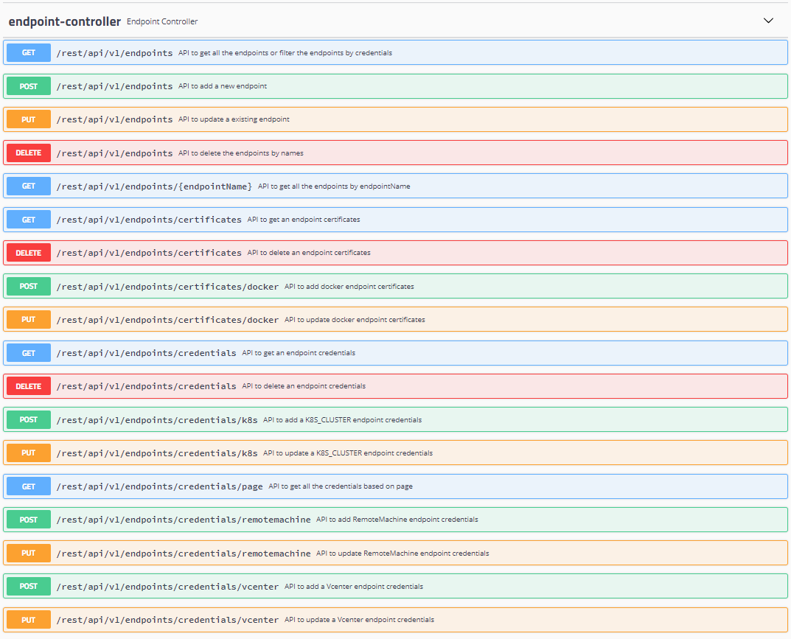

# Adding Endpoints

## Supported Endpoints

Endpoint in Mangle refers to an infrastructure component that will be the primary target for your chaos engineering experiments. For version 1.0, Mangle supports four types of endpoints:

1. Kubernetes
2. Docker
3. VMware vCenter
4. Remote Machine

#### Kubernetes Endpoint

Mangle supports K8s clusters as endpoints or targets for injection. It needs a kubeconfig file to connect to the cluster and run the supported faults. If a kubeconfig file is not provided, Mangle assumes that it is running on a K8s cluster and targets the same cluster for fault injection.

| Tested Versions of K8s |
| :--- |
| v1.9.6, v1.9.9 |

**Steps to follow:** 

1. Login as an user with read and write privileges to Mangle.
2. Navigate to Endpoint tab ---&gt; Kubernetes Cluster.
3. Click on .
4. Enter a name, credential \(kubeconfig file\), namespace \(mandatory...Please specify "default" if you are unsure of the namespace else provide the actual name\), tags \(refers to additional tags that should be send to the enabled metric provider to uniquely identify faults against that endpoint\) and click on **Test Connection**.
5. If **Test Connection** succeeds click on **Submit**.
6. A success message is displayed and the table for Endpoints will be updated with the new entry.
7. Click on  against a table entry to see the supported operations.

#### Docker Endpoint

Mangle supports docker hosts as endpoints or targets for injection. It needs the IP/Hostname, port details and certificate details \(if TLS is enabled for the docker host with --tlsverify option specified\) to connect to the docker host and run the supported faults.

| Tested Versions of Docker |
| :--- |
| 1.13.1, build 092cba3 |
| 17.06.0-ce, build 02c1d87 |
| 18.09.3, build 774a1f4 |

**Steps to follow:** 

1. Login as an user with read and write privileges to Mangle.
2. Navigate to Endpoint tab.
3. Click on .
4. Enter a name, IP/Hostname, port details, tags \(refers to additional tags that should be send to the enabled metric provider to uniquely identify faults against that endpoint\), certificate details \(if TLS is enabled for the docker host\)and click on **Test Connection**.
5. If **Test Connection** succeeds click on **Submit**.
6. A success message is displayed and the table for Endpoints will be updated with the new entry.
7. Click on  against a table entry to see the supported operations.

#### VMware vCenter Endpoint

Mangle supports VMware vCenter as endpoints or targets for injection. It needs the IP/Hostname, credentials and a vCenter adapter URL to connect to the vCenter instance and run the supported faults.

| Tested and Supported Versions of VMware vCenter |
| :--- |
| vCenter versions 6.5 and above |

**Steps to follow:** 

1. Login as an user with read and write privileges to Mangle.
2. Navigate to Endpoint tab.
3. Click on .
4. Enter a name, IP/Hostname, credentials, vCenter Adapter URL \(format: "_https://&lt;IP/Hostname&gt;:&lt;Port&gt;_"where the IP/hostname is the docker host where the adapter container runs appended with the port used\), username, password, tags \(refers to additional tags that should be send to the enabled metric provider to uniquely identify faults against that endpoint\) and click on **Test Connection**.
5. If **Test Connection** succeeds click on **Submit**.
6. A success message is displayed and the table for Endpoints will be updated with the new entry.
7. Click on  against a table entry to see the supported operations.

#### Remote Machine Endpoint

Mangle supports any remote machine with ssh enabled as endpoints or targets for injection. It needs the IP/Hostname, credentials \(either password or private key\), ssh details, OS type and tags to connect to the remote machine and run the supported faults.

| Tested Versions of Remote Machines with OS type | Versions |
| :--- | :--- |
| CentOS | 7, 7.6 |
| Debian | 8, 9 |
| Photon OS | 1, 3 |
| RHEL | 7.4, 7.5 |
| Suse | 12, 15 |
| Ubuntu | 16, 18 |

**Steps to follow:** 

1. Login as an user with read and write privileges to Mangle.
2. Navigate to Endpoint tab.
3. Click on .
4. Enter a name, IP/Hostname, credentials \(either password or private key\), ssh port, ssh timeout, OS type, tags \(refers to additional tags that should be send to the enabled metric provider to uniquely identify faults against that endpoint\) and click on **Test Connection**.
5. If **Test Connection** succeeds click on **Submit**.
6. A success message is displayed and the table for Endpoints will be updated with the new entry.
7. Click on  against a table entry to see the supported operations.

## Relevant API Reference


**For access to Swagger documentation:**

Please traverse to link **** -----&gt; API Documentation from the Mangle UI or access _https://&lt;Mangle IP or Hostname&gt;/mangle-services/swagger-ui.html\#_/_endpoint-controller_

   


